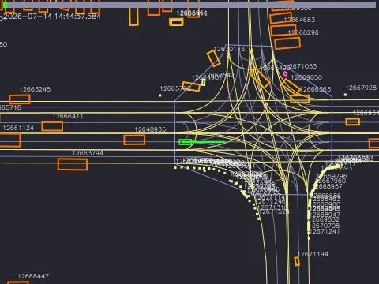
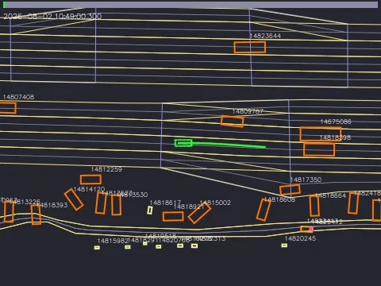
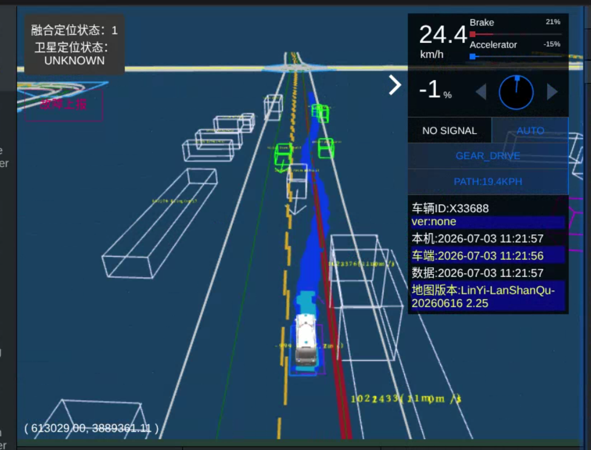

# 王强转正答辩

## 一、自我介绍

## 教育背景

武汉理工大学 \| 交通运输工程 \| 硕士在读

2024\.09 \- 至今

- 课题组：武汉理工大学智能交通系统研究中心（水路交通控制全国重点实验室）

- 研究方向：自动驾驶规划

重庆交通大学 \| 交通设备与控制工程 \| 学士

2020\.09 \- 2024\.06

- 排名：5/114

- 荣誉奖励：重庆市优秀毕业生

## 项目经历：

个人主页：https://wangxqiang21\.github\.io/

**OnSite 虚实融合自动驾驶实车赛**                                                        主要成员                              2025\.11\-2025\.12    

比赛简介：OnSite 虚实融合自动驾驶实车赛是一项面向自动驾驶规划控制算法工程落地能力的实车竞赛，2025 年在北京通州测试场与上海同济大学测试场两地开展，共 15 个测试场景，采用虚实融合方式将交通流与动态障碍物注入车辆感知系统，参赛车辆在真实场地与真实动力学约束下完成安全稳定的闭环行驶。

本人贡献：

- 设计 RViz 算法调试可视化界面，实时展示车辆状态、定位状态、控制量、道路边界、规划轨迹、预测障碍物轨迹及各场景参考速度，显著提升规划控制链路的 Debug 与迭代效率。

- 设计行为层参考速度规划算法，将红绿灯、行人、跟车、弯道、汇入/环岛侧向来车、非机动车、终点减速等场景转化为速度约束，通过多场景安全速度取最小值输出当前最优参考速度。

- 参与 iLQR 局部轨迹规划与 CasADi\-NMPC 控制算法调试，通过场景状态切换、参数自适应、路径跳变抑制、停车保持、jerk 限制和转角滤波，提升复杂场景下的舒适性、稳定性与通行效率。

- 设计交通流障碍物轨迹预测模块，结合道路参考线、Frenet 坐标和历史轨迹信息，预测背景车与非机动车未来轨迹，为 iLQR 规划层提供动态避障约束。

**SPMT 自动驾驶控制算法开发**（湖北三江航天万山特种车辆有限公司）                主要成员       2025\.07\-2025\.08

项目背景：面向 SPMT 特种多轴车辆自动驾驶项目，围绕低速重载、路径循迹、后部对接等典型场景，完成组合导航接入、控制点坐标补偿与路径跟踪控制，提升车辆多工况循迹稳定性和对接可靠性。

本人贡献：

- 负责 SPMT 项目的组合导航接入、安装标定与定位数据校验，基于导远 5711 话题获取经纬度、航向角、速度等车辆状态信息。

- 参与完成 WGS84 经纬度到 UTM 坐标的转换，并结合车辆尺寸对导航安装点、车头、后轴及后部控制点进行坐标补偿，提升前进、倒车和对接工况下的控制点一致性。

- 基于 Spline2D 设计参考路径，参与路径跟踪控制调试，覆盖直线、圆形、八字、双移线、倒车与对接等典型实车工况。

- 基于现有 CAN 遥控接口完成控制闭环适配：横向控制采用 Pure Pursuit 路径跟踪算法，纵向控制采用 PID 速度控制思路，完成预瞄距离、等效轴距、转向比例、速度指令、限幅和停车阈值等参数的实车整定与数据复盘。

## 二、实习工作汇总

|方向：自动驾驶规划 / PnC|Mentor：@戴浩君@林诚|
|---|---|
|部门 / 团队：AD 一部 PNC|实习时间：2026\.06\.17 — 至今|
|工作重点：排队绕行、逆向车避让|总产出：合并18个MR，2个优化项正在测试、排队绕行Skill、建立个人场景集3个|

### **1\.排队绕行问题**

排队绕行框架：JudgeWhetherForbidDetourQueueObsBeforeJunction[排队禁绕机制](https://r3c0qt6yjw.feishu.cn/wiki/Ev9KwRq5LihM6Wk2fbXcUFEtnOe?from=from_copylink)

**排队禁绕机制**：

- **阶段 0 · 帧初 \+ 全局豁免**：清 reason 与跨中线锚点池；云控绕行 / 施工区 / 参考线是泊车道 / 非机动车道等场景直接早退，不再判排队，避免误判。

- **阶段 1 · 绕行执行中保护**：ego 已进入绕行流程时避免半途中止 —— tf\_assisted / obs\_departure\_weak 要求队首稳定静止才允许 skip；obs\_dep\_strong 跟随车流换道，过五道闸门（物理阻挡 / 队首稳定 / 近期未起步 / 无抑制信号 / 目标方向允许借道）才允许 skip 触发新绕行。

- **阶段 2 · 排队表\+ 分档裁决**：遍历前方障碍，先利用排队表做筛选；`IsObsForbidDetour` 按几何画像判是否排队车；`CalcForbidDetourObsDisToJunction` 算 obs 到路口/停止线距离并分成 4 档；各档按有灯/无灯 \+ 是否绕行中给不同排队计数门槛。

- **阶段 3 · 循环外补充判定**：兜住主循环计数不足但仍需禁绕的场景 —— 中距非死车累计、`IsSupplementaryQueueByFrontMotion` 队首动转静补充（优先级高于 relax）、上帧禁绕的稳定维持、P7 刹车灯独立触发。

- **阶段 4 · relax 门控**：邻车道真的可借道 \+ 车流通畅时撤销禁绕，避免过保守卡死；六道 NOT\-relax 检查（近路口非死车 / 自车低速 / 视野遮挡近距 / P7 / 多车确认刹车 / 无 forbid 障）任一命中就不撤销。

- **阶段 5 · relax 后的硬禁绕**：覆盖 relax 的两类强制禁绕 —— 长排队 \+ 邻道偏航偏离导航；实线路口存在风险障 \+ 左右都不可借道。属最后一道拦截，relax 也盖不住。

- **阶段 6 · 最终落账**：排队车加忽略列表防止路径规划继续绕它们；`CreateVirtualObsForForbidDetour` 生成刹停虚拟障碍；最终闸门 `IsObsInForbidDetourList` 要求队首本身在 forbid 列表（或非死车、或已越过死车且前方还有排队车）才真正写入 `queue_obs_forbid_detour`。

**工作重点**：以上 7 阶段的判据/门控构成排队禁绕保护链，本次实习期间聚焦其中的 **4 个模块**展开优化：

- **阶段 1 绕行中保护 · unlock 通道（****`obs_dep_strong`**** / ****`tf_assisted`**** / ****`CheckObsDepSuppression`****）**

- **阶段 2 主循环 · 排队表设计**（`IsObsForbidDetour`）

- **阶段 2 主循环 · 分档计数**（`IsQueueCountSufficientForBand`）

- **阶段 3 循环外补充 · 稳定维持入口 \& 视野遮挡**（`IsEgoFrontObstacleBlockDetectView`）


#### **1\.1 长排队逻辑优化**

**问题背景**：交通灯路口前长排队场景下（路口 100–200 m），感知只识别到 2–3 辆前方排队车、上一帧已判为排队，但本帧 `queue_obs_forbid_detour` 保护链出现空档，Planning 误触发左绕行，从队伍旁边钻出去。

相关 case：**DC\-7610229**（100–200 m 长排队 \+ 左邻道高速来车 → 左侧碰撞）、**AIP\-378410**（直行 \+ 左偏航 \+ 130 m 长排队计数不够）、**AIP\-380293**（前车动转静排队计数不足 / 非路口无灯直行 early return 漏识别 / relax gate 4 处判定过松）。

1. **根因分析**

`queue_obs_forbid_detour` 由一条**识别 → 计数 → 稳定 → 保护 → 放行**五级链路产出，任一环漏则整链失效。实现在这条链上有 **6 处协同漏洞**叠加，让保护置位不了 / 置位后又被撤销 / 撤销后 fallback 又触发绕行：

|环节|漏洞|后果|
|---|---|---|
|**① 识别（****`IsObsForbidDetour`****）**<br>|a\) sided 免除只看横向位置：完全靠一侧的排队车被 `IsObsLeftParked/RightParked` 判成"靠边违停"排除；<br>b\) `cross_lane_center` 是所有分支的前提：**完全靠一侧、不跨中心线**的队尾车（如 `obs_l=[-2.09,-0.18]` 全在右侧）走不到任何 forbid 分支，直接漏检|DC\-7610229：ref\_line两侧出现排队车，但没被纳入 forbid\_detour\_obs|
|**② 计数（****`IsQueueCountSufficientForBand`****）**<br>|a\) 100–200 m 段阈值 `calc_min_queue_cnt(3, 4)`——该距离感知常只识别 2 辆，达不到阈值；<br>b\) double\_check 依赖 `IsStableOn(20 帧)` 硬阈值，前车刹车灯已 `CONFIRMED_ON`（5 帧）但尚未累积 20 帧时被 skip|队首刹车灯已连续 10–68 帧 CONFIRMED\_ON，但 `left_lane_has_slow_vehicle_obs` 检测滞后 480 ms，`queue_forbid` 迟迟置位不了|
|**③ 稳定策略入口过窄**|"上一帧禁绕 \+ 本帧列表非空 → 维持禁绕"依赖 `refer_lane_obs_block_detect_view`（视野被遮挡）；**开阔视野下的红灯排队进不去**，感知冷启动一帧就丢掉上一帧 forbid|AIP\-378410 / DC\-7610229：红灯前视野开阔时稳定策略跳过 → 空档触发绕行|
|**④ 补充识别缺失 \+ early return 阻断**|a\) 前车"动转静"（`kActiveToInactive`）后感知计数还没累积够，没有补充识别路径；<br>b\) `JudgeWhetherForbidDetourQueueObsBeforeJunction` 顶部 early return：非路口 \+ 无灯 \+ 直行直接返回，本车道其他排队场景漏识别|AIP\-380293：前车刚停下，禁绕永远置位不了；直行普通路段的排队完全不进识别路径|
|**⑤ Relax Gate 四处过松**|a\) 只看邻道空间可借，忽略车流速度；b\) 忽略自车速度（低速排队被 relax）；c\) 只要有一侧 OK 就双侧放行，两侧都借方向不确定；d\) 前车动转静场景仍走 relax|DC\-7610229：`queue_forbid` 置位了又被 `ShouldRelaxQueueForbidByBorrow` 撤销|
|**⑥ Fallback 无 guard \+ 抑制链缺帧**|a\) `arbiter_lc_fallback_to_detour`：LC 15 帧不激活自动 fallback 到 detour，**不 check** `queue_obs_forbid_detour`；<br>b\) `CheckObsDepSuppression` 调用位置在 `forbid_detour_obs` 写入之前，当前帧 forbid 列表为空 → 3 条抑制规则里 2 条读到空 vector 而失效|DC\-7610229：queue\_forbid 已置位但 fallback 分支直接绕过它触发绕行；随车流 obs\_dep 强信号解锁抑制不生效|

2. **关键洞察**：单一保护环没坏，是**保护链的每一环都留了缝**——识别少一辆、计数差一档、稳定策略进不去、保护被 relax 撤销、fallback 再绕过 guard。加固要在每一环补齐正交证据（横向 → 纵向、Stable → Confirmed、遮挡 → 遮挡 \|\| 交通灯），而不是把某一环阈值单纯放宽。

3. **解决方案**

按上面 6 个环节协同修复：

**3\.1 识别环：sided 免除加方向前提 \+ 新增逻辑 4**

- **sided 免除加方向前提**：仅当 `obs->min_l() > 0 && min_l < 1.5 × 车宽`（完全在参考线左侧且够近）时才免除 `block_obs_left_sided`；`max_l` 侧对称。跨中心线的车两侧条件都不命中，保持原判定。

- **新增逻辑 4**：`!cross_lane_center && is_same_direction && !sided && !is_dead_car() && close_to_ref_line`——把"完全在参考线一侧、内侧到参考线 \< 1\.5 × 车宽"的排队车收进 forbid 池。**死车必须排除**：否则死车与排队并存场景下 `queue_forbid` 会保护住死车，自车停在死车后不绕行。

**3\.2 计数环：100–200 m 段阈值下调 \+ double\_check 用 CONFIRMED\_ON**

- 100–200 m 段 `calc_min_queue_cnt(3, 4)` → `calc_min_queue_cnt(2, 3)`，与 50–100 m 段对齐；上游 sided 过滤 \+ 下游 `brake_light_multi_confirmed` gate 双侧兜底防误置位。

- `IsQueueCountSufficientForBand` 新增参数 `brake_light_stable_cnt`：forbid 列表内 ≥ 1 辆 `IsConfirmedOn`（5 帧确认）即视为真排队队伍，跳过"左车道也要有慢车"的 double\_check。三处调用点（100–200m / 50–100m / \<50m）现场用 `CountConfirmedBrakeLightInQueue` 算，避免 `IsStableOn(20 帧)` 硬阈值的时序滞后。

**3\.3 稳定策略环：入口放宽为"遮挡 \|\| 交通灯"**

把 `refer_lane_obs_block_detect_view` 硬前提改为 `refer_lane_obs_block_detect_view || ego_lane_has_traffic_light`——交通灯等待期本身就是排队典型场景。两个硬前提（`last_queue_forbid` \+ 本帧列表非空）保持不变；策略只把已稳定的排队状态跨过感知抖动那一帧。

**3\.4 补充识别环：新增 IsSupplementaryQueueByFrontMotion \+ 移除 early return**

- 新增 `IsSupplementaryQueueByFrontMotion`：**整体排队结果为 false（计数不足）时**，前车动转静（`kActiveToInactive`）或运动且 \< 10 kph 时，按视野 / 邻道偏航 / 车道线属性判排队。命中路径记 `supp_front_motion_forbid = true`，**优先级高于 relax gate**（不参与后续 relax 判定）。

- 移除"非路口 \+ 无灯 \+ 直行"early return，让这些场景也走排队识别路径。

**3\.5 Relax Gate 环：新增 4 个收紧条件**

1. **路口 200 m 内前车非死车 → 直接不 relax**（reason: `non_dead_car_near_junction`）；

2. **自车 \< 5 kph \+ 上一帧已排队 → 不 relax**（reason: `ego_low_speed&last_queued`）；

3. **车流通畅判定从"无慢车" 改为"邻道无车 \|\| 邻道平均速度比自车快 \> 20 kph"**——原 `left_lane_has_slow_vehicle_obs` 只有慢车信号，改用 `outside_planner_data.left/right_traffic_flow_info`；

4. **单侧 OK 时强制只借该侧**：`allow_borrow_<other>_lane = false`，避免两侧都借方向不确定；**上一帧已在执行的绕行方向不被反向 gate 打断**；

5. **forbid 列表内 ≥ 1 辆车 ****`IsConfirmedOn`**** → 不 relax**（reason: `brake_light_multi_confirmed`）——违停车不会稳定踩刹车；

6. **补充识别路径产出的 forbid（****`supp_front_motion_forbid`****）跳过 relax**——补充识别本身依赖强证据，不再让 relax 撤销。

**3\.6 保护链末端：fallback guard \+ 抑制链缺帧回退**

- `arbiter_lc_fallback_to_detour` 触发前 **check**`queue_obs_forbid_detour`：命中则记 `arbiter_lc_fallback_suppressed_by_queue_forbid`，走"等待"而非"绕行"。

- `DataCenter` 新增 `last_frame_forbid_detour_obs_ids` \+ 时间戳缓存，`CalcDetourCommonContext` 在 `JudgeWhether...` 调用后写入当前帧 id 快照。`CheckObsDepSuppression` 在当前帧 `forbid_detour_obs` 为空且缓存新鲜（\< 0\.5 s）时，用上一帧 id 反查当前帧 `obstacle_map` 得到近似 forbid 列表参与判定，3 条抑制规则不再读到空 vector。


#### 1\.2 排队表逻辑优化

**问题背景**：`IsObsForbidDetour` 用于逐 obs 判定"是不是排队车"，命中者进入 `forbid_detour_obs` 池，达阈后置位 `queue_forbid` 抑制绕行；未命中者视为路边违停车，允许绕行。红灯路口前**排队队首**（`is_first_candidate`，距 ego 最近的候选车）常有一侧车身压近参考线，会被 `IsObsRightParked` / `IsObsLeftParked` 判成"靠边违停"排除在排队池外——队首缺席使 `queue_forbid` 无法置位，ego 从排队队伍旁边钻出去。

典型 case：obs 1951552（sim\-task\-15369584 `[time:1786936169.42]`）、obs 13947414（sim\-task\-14980363，感知抖动一帧掉出）、Case 3247653（路边孤立车反被算成排队）、AIP\-378410。

**1\.根因分析**

核心难点：**单看横向位置无法区分"靠边违停"与"贴边排队"**——两者 `obs_l` 形态一致。旧实现叠加 5 处判据 / 结构缺陷：

|缺陷|触发条件|后果|
|---|---|---|
|**① 队首默认不豁免 sided 判定**|队首一侧车身压近参考线时 `block_obs_*_sided = true`，逻辑 1 命中不了|排队队首掉出 `forbid_detour_obs`|
|**② 刹车灯用严格态**|用当前帧 `IsConfirmedOn` 判队首是否在排队|感知抖动一帧（`confirmed_on` 34→0）就让队首掉出，逐帧震荡|
|**③ 前车选取错 \& near\_gate 语义错位**|近前车从**全量** `ego_lane_front_obstacle` 里找（含路边停车 / 非排队目标）；`near_gate` 量 obs 自身车头到停止线的距离|a\) `front_gap` 假性偏小造成误判；<br>b\) 队伍里越靠后的车离停止线必然越远，队尾成员被判成"离闸门太远"|
|**④ 逻辑 2/3 之间留缝**|逻辑 2 要求 `!right_parked && dr >= 0.5`，逻辑 3 要求 `!in_lane`；**车身完全在车道内、却贴死右边界（dr \< 0\.5）**两侧都不收|obs 1951552：`obs_l=[-1.81, 0.22]`、`dr=0.16`，`right_parked=true` 被逻辑 2 挡、`in_lane=true` 轮不到逻辑 3，实际压中线 22 cm、前方 6\.7 m 抵着停止线的 1994045，确实在排队却被漏检|
|**⑤ 单槽位锚点自污染**|锚点是"排队车 `min_s`"跨帧快照，用于判定 obs 是否"紧邻排队队伍"；旧实现只保留一个槽位，只能是**队尾**（离 ego 最近）|队伍里除队尾外的车都拿不到锚点，只能退化到停止线距离；队首豁免后又把自己写进锚点池，下一帧查询取到自身而退化，逐帧进出|

**2\.关键洞察**：横向位置（`obs_l`）是"什么姿势停着"的信息，独立分辨不出"为什么这么停"。要区分靠边违停与贴边排队，必须引入正交的**纵向排队关系**（`near_anchor` = 与前方逻辑 1/2/3 排队车 / 停止线的间距）与**时序证据**（刹车灯永久闩锁 `ever_confirmed_on`）。

**3\.解决方案**

MR 分两版本落地：[\!6824](https://git.neodrive.neolix.net/neolix/pnc/planning/-/merge_requests/6824)（v10\.11pr1 上线）先修 `is_first_candidate` 守卫 \+ 逻辑 5 兜底 \+ 逻辑 4 显式 `obs_center_in_lane`；[\!7034](https://git.neodrive.neolix.net/neolix/pnc/planning/-/merge_requests/7034)（orin\_dev 当前进行中）系统重构、把 `IsObsForbidDetour` 拆成两趟判定 \+ 双证据 \+ 升序锚点数组。

**3\.1 队首豁免机制（brake\_light\_tracker \+ scenario\_common）**

- `BrakeLightTracker` 新增 `ever_confirmed_on`：`confirmed_on_frames` 累计达 `kEverConfirmFrames = 10` 后**永久置位、跌落不清**，新增查询接口 `IsEverConfirmedOn`。

- 队首若满足**「****`inner_l_abs < 0.3`**** \+ ****`ever_on`**** \+ ****`near_anchor`**** \+ ****`!at_diverge`****」**，同时清 `block_obs_right_sided` / `block_obs_left_sided`，让其走 side\_overlap 进入排队池。刹车灯只作进入候选的**门槛**：进池后维持与否交由下游 side\_overlap 几何、距离分档、最终闸门筛选。

- 队尾车贴队伍一侧行进时也被靠边判据误伤——对"完全在参考线一侧 \+ 中心仍在车道内 \+ 内侧离参考线足够近"的**非队首车**同样免除对应侧的排除（DC\-7610229 / Case 3247653）。

**3\.2 排队锚点距离判据（near\_anchor）**

把旧的"近前车 \+ 近闸门"合并为 `near_anchor = near_front || near_gate`：

- **near\_front（优先）**：前方有排队车时量到**紧邻前方逻辑 1/2/3 排队车**的车尾——只认命中逻辑 1/2/3 的车（不认全量 `ego_lane_front_obstacle`）；`front_gap < 2 × obs_length` 即算紧邻。

- **near\_gate（退化）**：前方没有排队车才退化到停止线 / 路口，`gate_gap`**严格 \> 0**（obs 已过 gate 时不用绝对值再判"近"，避免已过路口的车被误判）且 `< 2 × obs_length`。

**时序倒置**：`forbid_detour_obs` 不可直接查——主循环按 `min_s` 升序填充，处理某辆车时它前方的车尚未判定。故在逻辑 1/2/3 命中处就地记录，帧末快照到 `DataCenter`，供下一帧回看。排队场景车速近 0，一帧（10Hz）的 s 误差远小于 2 × 车长阈值。

**3\.3 新增逻辑 4：右一车道贴边压中线的排队车**

补齐逻辑 2/3 之间的缝：**车道内 \+ 跨中线 \+ 同向 \+ 非死车 \+ ****`near_anchor`**** \+ ****`!at_diverge`**** \+ ****`block_left_view`** 独立成分支，`reason = cross_right_queue`，日志可直接区分。**左侧视野守卫**（`block_left_view`）作为必要条件：仅当 obs 挡住 ego 左侧视野时才认作排队；**ego 左侧视野未被遮挡时 ego 有条件安全绕行，不必保住这类队首车**——避免"非分流域 \+ 排队几何"两条件叠加就把可绕行的队首过度保护。`block_left_view` 通过 `IsEgoFrontObstacleBlockDetectView` 分侧遮挡判定拿到。

`at_diverge` 计算：从`traffic_conflict_zone_context` 自算，阈值放宽到 50 m 并叠加 `IsFakeDiverge`（路口内带 traffic light 的伪分流不算），覆盖典型分流场景。


左侧视野遮挡（排队禁绕）                                                         左侧有视野（解除排队）

**3\.4 结构重构：拆成两趟判定**

队首豁免会污染锚点池（队首经尾灯豁免清 sided 后走逻辑 1、写进锚点池、下一帧查到自己、退化、掉出、再进池……逐帧震荡）。按证据类型拆开：

||判据|读锚点|登记锚点|
|---|---|---|---|
|第一趟|逻辑 1/2/3（只看自身几何）|否|**是**|
|第二趟|逻辑 1 复判 / 4 / 5 / 6（依赖锚点 \+ 尾灯豁免）|是|**否**|

**3\.5 排队锚点**

`DetourContext` 新增 `std::vector<double> cross_lane_obs_min_s`，记录本帧**所有**第一趟命中车的 `min_s`。主循环本身按 `min_s` 升序，`push_back` 天然有序。帧末快照到 `DataCenter::last_frame_cross_lane_obs_min_s`，下一帧用 `upper_bound(anchors, obs->max_s())` 取第一个严格位于自己车头前方的锚点作为紧邻前车：

- 复用 `last_frame_forbid_detour_obs_time` 做 **0\.5 s 新鲜度**校验，`dt > 0` 严格排除同帧自参照（`CalcDetourCommonContext` 一帧内被多次调用，允许 `dt == 0` 会读到自己刚写的锚点）。

- 帧初 `JudgeWhetherForbidDetourQueueObsBeforeJunction` 里 `clear()`——数组是 `Frame` 成员帧内不自动重置，不清空会重复追加导致失序，`upper_bound` 取到错误锚点。

**4\.** **MR：**

https://git\.neodrive\.neolix\.net/neolix/pnc/planning/\-/merge\_requests/6824

https://git\.neodrive\.neolix\.net/neolix/pnc/planning/\-/merge\_requests/7034

**产出：修改后的排队表判据 \& 后续优化方向**

**修改后的排队表判据（****`IsObsForbidDetour`**** 六路分支概览）**

|路径|触发几何 / 证据|reason 标签|
|---|---|---|
|**逻辑 1** 非最右车道跨中线|`cross_lane_center && !is_right_first_lane && is_same_direction && !sided`|`cross_mid`|
|**逻辑 2** 右一车道跨中线 \+ 右侧余量|`cross_lane_center && is_right_first_lane && in_lane && !right_parked && dr >= 0.5`|`cross_right`|
|**逻辑 3** 右一车道向左探出跨中线|`cross_lane_center && is_right_first_lane && !in_lane && dr ∈ [0.5, half_lane]`|`cross_right_out`|
|**逻辑 4**（**新增**）右一车道贴边压中线|`cross_lane_center && is_right_first_lane && in_lane && !is_dead_car && near_anchor && !at_diverge && block_left_view`|`cross_right_queue`|
|**逻辑 5** side\_overlap 队尾|`!cross_lane_center && is_same_direction && !sided && inner_l_abs < 1.5 × 车宽`|`side_overlap`|
|**逻辑 6** 中心在车道外斜插|`center_l 在车道外 + 车头斜朝车道内 + inner_l_abs < 0.5`|`angled_inbound`|


#### **1\.3 随车流误绕行**

**问题背景**：**无信号灯**路口前方正常排队（2–3 辆前车、速度 0、刹车灯未亮），自车靠近后被"跟车流绕行"信号\(unlcok机制\)误触发绕行——或跨双黄借逆向车道，或从右侧钻非机动车道。应停等的场景变成危险绕行。

典型 case：**AIP\-387763**（无信号灯路口正常排队被误绕）；**sim\-9006196**（合流路口 1 辆合流车 5247425 触发伪 strong）。

1. **根因分析**

绕行有一条"跟车流 unlock"的快速通道：`DetourObsDepartureTracker` 观察前方 obs 的 `DEPARTING → CROSSED` 阶段，累到 `strong_dep_count >= kStrongDepartureCount` 就走 `obs_dep_strong`——**跳过 ****`queue_obs_forbid_detour`**** 检查、允许触发新绕行**；如果目标侧还是逆向车道（左邻是双黄），进一步 override 逆向借道禁令。

这条通道设计上要求"车流已经稳定绕过"，实际有 **4 处漏洞**让单辆合流车 / 邻道正常变道车就能把它顶穿：

|漏洞|触发条件|后果|
|---|---|---|
|**① CROSSED 计数不分通道**|tracker 把两类 obs 记同一份 `left_crossed_count`：<br>A\) obs 首次在 ego 车道内、后跨出去（真变道）；<br>B\) obs 首次就在车道外的 `reverse_lane_obs`（同向借逆向道绕行）|合流路口一辆合流车走 B 通道 1 帧就把 `strong_dep_count` 顶到门槛|
|**② 逆向判据用 ****`is_left_first_lane`**|`IsTargetSideReverseOrSingle` / `has_adjacent_left` 都用**"ego 是不是最左车道"**判定左侧是逆向；合流路口 `lane_idx: 0/2` 但 `L_div = SOLID_WHITE`（同向分隔线）也被算成"无邻道"|阈值 `kStrongDepartureCount` 被错误降到 1；同向合流车错走 `reverse_lane_obs` 快速通道|
|**③ 跨双黄 override 只看 crossed 总数**<br>|`reverse_detour` 逆向借道 override 分支只判 `strong_dep_dir == LEFT`，没检查**真正从 ego 车道跨过去的车有几辆**|1 辆首次就在逆向道的车就能跨双黄豁免|
|**④ skip 路径没有 ****`stable_static`**** gate**|tf\_assisted / obs\_dep\_strong 两条 skip 通道入口只判"车流条件成立"，不检查**前车本身是否死堵**（`is_dead_car()` / `kInactive`）也不检查方向|AIP\-381777：前车 `hb=kActive`（正常行驶）时也触发跟车流助推错误绕行；skip 后下游还有**目标方向反转**硬伤——`CROSSED` 向左却触发向右绕|

2. **关键洞察**：跟车流 unlock 的语义是"车流已经稳定绕过死堵前车"，把"绕过 ego 车道"和"从别处冒出来"混作一类计数，把"ego 是否最左"当成"左邻是否逆向"，是两个语义偷换。加固要点是**分通道 \+ 用几何证据 \+ 分级 gate**——tracker 记录 `reverse_lane_obs` 属性、判据换成 `left_divider().type`、每层 skip 各带 `stable_static` guard。






**3\.** **解决方案**

**3\.1 CROSSED 分通道 A/B \+ 逻辑或合并**

- `HistoricalCrossed` 结构新增 `reverse_lane_obs` 字段（保留 obs 是不是 B 通道产出的属性），`CleanupExpired` / `SoftReset` 转历史时同步落地。

- `Summarize` 分四组统计 `left/right_crossed_channel_a/b`，A 通道 `>= kStrictCrossedMinCount(2)`、B 通道 `>= kReverseCrossedMinCount(2)`，各自达门槛才计入；两通道最后取 `max`（逻辑或），**不累加**——任一通道达标就够。

- `SoftReset` 加去重插入：A→B→A 振荡时同一 `obs_id` 可能被多次 push\_back，用 `existing_ids` set 抹平。

**3\.2 逆向判据换成 divider 类型**

- `IsTargetSideReverseOrSingle` 签名多带 `TaskInfo`，左侧逆向条件从 `is_left_first_lane` 改为 `l_div.type in {DOUBLE_YELLOW, SOLID_YELLOW}`；提供 `bool left_is_reverse` 直传的重载，单测不用构造完整 `TaskInfo`。

- `TrackDetourObsDeparture` 里 `has_adjacent_left` 同步用 `l_div` 判定；**只有真逆向侧才让首帧在车道外的 obs 进入 ****`reverse_lane_obs`**** 通道**。右侧不改（右侧不可能是逆向车道）。

- 删除 `IsReverseOrSingleLane` 死代码，统一常量引用。

**3\.3 跨双黄 override 收紧：≥ 2 辆 strict CROSSED**

`reverse_detour_ctx` override 分支入口，就地统计 `strict_left_crossed`：active tracks 中 `side==LEFT && !reverse_lane_obs` 计一份，历史 `historical_crossed_records` 再补一份（**guard ****`tracks.count(hc.obs_id) > 0`** 防止 obs 消失 push 到历史后又重新出现时被重复计数）。`>= kStrictCrossedMinCount(2)` 才 override 双黄。

**3\.4 tf\_assisted / obs\_dep\_strong 两条 skip 加 ****`stable_static`**** 和occ  gate**

两条 skip 入口统一检查：`block_obs->is_dead_car() || history_behavior == kInactive`；不满足时打 `[DetourTF/ObsDepart-Strong] NOT skipping queue_obs_forbid: block_obs not stable static`，保留 `queue_forbid`。

**3\.5 obs\_dep\_strong skip 追加目标方向 gate**

`obs_dep_strong` 语义是"车流朝某方向绕行可行，允许自车也向该方向绕行"。skip `queue_forbid` 前检查 `allow_borrow_<suggested_dir>_lane`：目标方向被禁时不 skip，避免 `CROSSED` 向左却触发向右的方向反转硬伤。

**3\.6 queue loop 分档兜底**

`CalcForbidDetourObsDisToJunction` 里，`obs_start > 0 && obs_end < 0`（车头已过转向点但车尾未过）时用车尾距离代替，让排队卡车落进正确距离分档；`obs_end <= 0` 兜底后仍为负数时，若与上一辆已入队 obs 纵向间距在正常排队范围内，用车尾距离代替——参考 AIP\-387763 第 3 辆卡车 12675943。

```cpp
const auto stable_static_res = JudgeBlockObsStableStatic(task_info, *detour_ctx);
if (!stable_static_res.stable_static) {
  // occ 或非死堵 → 保留 queue_forbid
} else {
  // skip queue_obs_forbid_detour
}
```

3. MR：https://git\.neodrive\.neolix\.net/neolix/pnc/planning/\-/merge\_requests/6868


#### 1\.4 绕行期间被排队打断

**问题背景**：ego 在路口前触发绕行、执行到 `DETOUR_BACK` 阶段（已超过障碍物、正在回原车道）时，嘎感知出现新排队车，绕行被 `queue_obs_forbid_detour` 强制取消，ego 退回原车道重新等待约 **23 秒**。典型 case：**AIP\-405774**。

**根因分析**

**AIP\-405774（绕行被打断）**：`JudgeWhetherForbidDetourQueueObsBeforeJunction` 每帧无差别地跑排队计数分档判断，绕行执行过程中**新冒出的排队车**同样会推动计数达门槛、置位 `queue_forbid` 打断绕行。

|关键点|旧实现|问题|
|---|---|---|
|**阈值不区分绕行阶段**|各距离分档（≥200m / 100–200m / 50–100m / \<50m）用同一份 `calc_min_queue_cnt`|ego 已经切到旁边车道通过障碍物，新冒的排队车轻易凑到原门槛就打断|
|**保护范围过窄**|`tf_assisted_in_progress` 仅在 `detour_ctx->tf.unlocked` 时生效|brake\_light 触发绕行的场景无保护——只要 `detour_state` 在 INIT/OVERTAKE/DETOUR\_OUT 之外就漏|
|**状态耦合陷阱**|用 `detour_state` 判"是否绕行中"|绕行被打断后 `detour_state` 变 `OFF`，但 ego 物理上还在旁边车道——按状态判会立刻撤保护，事故已发生|

**关键洞察**：判定"是否处在绕行中"，**几何状态（横向偏移 \+ 航向偏差）比状态机字段更可靠**——状态机一旦被外力打断字段就掉，几何状态是物理事实无法立即回撤。凡是"状态可以被外力立即回撤但物理不会"的场景，都应用几何判据兜底。

**解决方案**

**3\.1 绕行执行阶段排队阈值 \+1**

在 `JudgeWhetherForbidDetourQueueObsBeforeJunction` 循环外，用**几何状态**而非 `detour_state` 判"绕行中"：

- **横向偏移**：`lat_departed = (detour_dir == LEFT && curr_l > 0.8) || (detour_dir == RIGHT && curr_l < -0.8)`；

- **航向偏差**：`heading_diff > 25°`（`0.436 rad`）；

- `is_detour_in_progress = lat_departed || heading_diff > kHeadingDiffThreshold`。

命中时对 4 个距离分档的 `calc_min_queue_cnt` 统一 `+1`：

```cpp
auto calc_min_queue_cnt = [&](size_t base_light, size_t base_no_light) {
  const size_t delta = is_detour_in_progress ? 1UL : 0UL;
  if (!has_traffic_light) return base_no_light + delta;
  const size_t cnt =
      (has_brake_in_queue && base_light > 0) ? base_light - 1 : base_light;
  return cnt + delta;
};
```

**不与 ****`detour_state`**** 取交集**：绕行被打断后 `detour_state` 会变 `OFF`，但 ego 仍在旁边车道，需要继续保护；`detour_state` 会掉、几何位置不会掉。

50–100m 和 \<50m 两档硬编码分支也同步加 `delta`：`(has_active_traffic_light ? 2UL : 3UL) + (is_detour_in_progress ? 1UL : 0UL)`。

**4\.MR：**https://git\.neodrive\.neolix\.net/neolix/pnc/planning/\-/merge\_requests/6891


#### 1\.5 视野遮挡代码优化

**问题背景**：`refer_lane_obs_block_detect_view` 是"前车挡住 ego 前方视野"的判定量，作为**排队稳定策略**（`queue_obs_forbid_detour` 跨帧维持）的一路入口条件。绕行期间 ego 航向与 ref 线航向发散、单辆缓慢/静止车前方有交通灯等场景下，该判定被误触发/被单车锁住，把本该绕行的 ego 锁在原车道。

典型 case：sim\-task\-14862083（obs 13704012 绕行期间视野误挡）、**AIP\-422798**（单辆静止车 412734 把 `queue_forbid` 自锁约 20 s、138 帧 `continue_tl_wait`）、AIP\-414688 / AIP\-423040（视野遮挡日志观测字段缺失）。

**视野遮挡机理**

`IsEgoFrontObstacleBlockDetectView` 判定"ego 前方视野带的左右两侧是否都被 obs 遮挡"。preview 距离取 `plan_config.detour_scenario.preview_front_distance`；若 `detour_ctx.ego_lane_has_traffic_light`，进一步 `fmin(preview_front_distance, stop_line_distance)` 收敛，避免视野带穿过路口停止线。从 ego 位置出发向前方 preview 距离作一条参考带，带子中心 \+ 左右两侧共 3 个投射点；分别求这些点与 obs 左右两个可见角楔切线的角度差（`left_diff` / `right_diff`），若**两侧都被角楔卡住**就置 `block_left_view = block_right_view = true`。

**根因分析**

MR 6993 定位到两处独立缺陷 \+ 一处观测缺失：

|缺陷|触发条件|后果|
|---|---|---|
|**① 视野走廊不跟 ego 走**|走廊左右检测点由 ref 线上的 `(s + preview, l = ±0.5)` 构建，**不随 ego 实际视线方向走**；ego 偏航 5\.68° 时，ego 左偏时左侧检测点反落进右侧障碍角楔（`left_diff = -0.01 rad` 临界误挡）|绕行期间 ego 航向与 ref 线航向发散时视野被误判为遮挡，喂给排队稳定策略入口 → 中止绕行|
|**② ego\_front\_l取的是后轴中心**<br>|后轴中心与设计要找的视野方向不符合<br>|基准点长期偏移，走廊位置不准|
|**③ 排队稳定策略入口过松**|入口条件是 `refer_lane_obs_block_detect_view || ego_lane_has_traffic_light`——"前方有交通灯"是**路口静态属性**不构成排队证据；分支 `last_detour_ctx.queue_obs_forbid_detour` 依赖自己上一帧输出，一旦点火便**自锁**无帧预算约束|AIP\-422798：`near_solid_lane` 擦出 1 帧点火 → `continue_tl_wait` 接手 138 帧、加上路口绿灯不足10s，但是`continue_tl_wait`观察期为10s,这样就无法绕行|

**关键洞察**：视野遮挡是**几何量**——它依赖 ego 视线方向而非车道方向。绕行/大角度调整时 ego 相对 ref 线偏航是常态，走廊必须**跟 ego 走**，同时对偏航范围钳制防止极端外推。上游几何量误判会传染下游状态机（排队稳定），故稳定策略也要把"能构成排队证据的信号"和"路口静态属性"分开门槛。

**解决方案**

**3\.1 视野走廊改用 ego 前角点基准 \+ ego 航向/参考线均值定中心**

- **基准点**：`ego_front_l` 改为 ego **前缘两角点**（前右 \+ 前左）投影 l 的中点，走廊随 ego 横向平移。

- **走廊半宽**：`detect_half_width = clamp(obs_half_width - 0.2, 0.5, 1.0)`——按 obs 投影半宽预留 **0\.2m** 余量（原固定 0\.5、余量 0\.1），上限 1\.0（原 1\.5 收紧到 1\.0，避免走廊过宽）。

- **检测带中心**：ego 航向 preview 点与 ref 线 preview 点（`l = ego_front_l`）的中点——ref 分量平滑去抖，ego 航向分量把中心拉回 ego 实际视线侧，消除绕行期间发散导致的带偏。

- **ego 航向对 ref 线航向的偏差钳到 ±20°**：绕行 / 大角度调整时 ego 航向可能与车道方向发散过大，直接外推 50 m 会让走廊严重偏出车道反向误判；`kMaxEgoRefHeadingDiff = deg2rad(20)`，超出即按符号钳制。

- **左右检测点**：`center ± detect_half_width × ego_nrm`（沿 ego 左法向）。


**3\.2 排队稳定策略入口：视野未遮挡时要求 ****`forbid_detour_obs.size() >= 2`**

把入口拆分：

```cpp
// 旧
if (!queue_obs_forbid_detour &&
    (detour_ctx->refer_lane_obs_block_detect_view ||
     detour_ctx->ego_lane_has_traffic_light) &&
    last_detour_ctx.queue_obs_forbid_detour &&
    detour_ctx->forbid_detour_obs.size() >= 1) { ... }

// 新
if (!queue_obs_forbid_detour &&
    (detour_ctx->refer_lane_obs_block_detect_view ||
     (detour_ctx->ego_lane_has_traffic_light &&
      detour_ctx->forbid_detour_obs.size() >= 2)) &&
    last_detour_ctx.queue_obs_forbid_detour &&
    detour_ctx->forbid_detour_obs.size() >= 1 &&
    (first_forbid_detour_obs == nullptr ||
     !first_forbid_detour_obs->is_dead_car())) { ... }
```

- **视野被遮挡**：单辆即可维持——看不见前方，保守认为在排队；

- **视野未遮挡**：仅"前方有交通灯"不足以判定排队——单辆缓慢/静止车会被误判并自锁（AIP\-422798），要求 `forbid_detour_obs.size() >= 2` 有多车实际排队证据才维持；

- 外层 `size() >= 1` 不变，不影响其他进入路径。


**4\.MR：**https://git\.neodrive\.neolix\.net/neolix/pnc/planning/\-/merge\_requests/6868


### 2\.逆向车碰撞问题

#### 2\.1 绕行期间误挂逆向车边界

**问题背景**：ego绕行右侧死车会把bound开到逆向车道、path 层用 `tcd_region_decision_graph_search`（TCD 区域决策图搜索）产出 upper / lower 走廊边界时，把**逆向对向车**误挂成本车轨迹的边界（应作 upper 时被搜为 lower、或反之），导致 trajectory 被推到逆向车一侧、直冲对方车道。

典型 case：**DC\-7167879**（绕行期间贴逆向来车、trajectory 越线）。

**根因分析**

`GenerateTCDRegionGraph` 的 `GenNode` 步骤按**几何位置**搜 lower\_edge / upper\_edge：obs 在 ego 左侧就当 upper（限制 ego 左移的上边界），在右侧就当 lower。这个几何判据没考虑**方向**——逆向对向车与顺向车在几何上可能同侧，图搜索无法区分：

|缺陷|触发场景|后果|
|---|---|---|
|**只按几何搜 upper / lower**|逆向车与 ego 侧向重叠、几何上落在"应该作 upper"的那一侧，被 `is_upper_found` 判据接管；反之亦然|ego 走廊边界压在逆向车错误一侧，trajectory 向逆向车方向推进|
|**没有绕行方向意识**|左绕行时"应挂 upper 的车被错挂为 lower"，右绕行反之——这两个错误方向不同，代码里都用同一分支处理|方向决策不能反映实际语义|
|**绕行参考线 l（****`detour_bias_observe_ref_l`****）在 ADJUSTING 阶段未设置**|状态机 ADJUSTING 阶段字段不写；右绕行时 `ego_right_lane_bound` 符号与 `OnHandleStateAdjusting` 约定不一致|参考线取值为 0，判据"obs 在参考线哪一侧"完全失效|

**关键洞察**：图搜索按几何位置分类 obs 边界归属，本质上把"这辆车物理占据了哪一侧"当成"这辆车应该限制轨迹哪一侧"——两者在**逆向车**场景语义不同。要修正必须把"方向属性"（`is_reverse`）从 `Obstacle` 一路透传到 `GenNode`；判据要按**绕行方向 \+ obs 方位区分**矩阵展开（3 种方位 × 2 种绕行方向）而不是一个粗分支。




**解决方案**

**3\.1 透传 is\_reverse \+ obs l 范围到图搜索节点**

`AABox2d` 结构新增 `is_reverse` / `obs_min_l` / `obs_max_l` / `obs_moving_left` 字段，从 `Obstacle` → `AABox2d` → `BoxSide` → `GenNode` 5 处 factory 预计算，通过 `FillReverseBoxFields` helper 统一。

- **方向判据换 ****`velocity_heading`**：`obs_moving_left` 用 `velocity_heading`（与 `ClassifyVruLatMotion` 同帧），避免 `heading()` 对倒车 / 对向车的浮点 tie 不稳定。

- **只在 ****`is_reverse = true`**** 且 ****`lane_side`**** 匹配时触发新分支**，非逆向 obs 走原路径不受影响。

**3\.2 A/B/C 三方位 × 左/右绕行的判据矩阵**

`tcd_region_decision_graph_search.cpp` 里，**左绕行** 在 `is_lower_found` 分支找挂错的 lower（应作 upper 但被搜为 lower）；**右绕行** 在 `is_upper_found` 分支找挂错的 upper：

|方位|左绕行|右绕行|
|---|---|---|
|**A · obs 整个在绕行参考线外侧**|obs\_min\_l \> L\_d：跳过 lower、主动挂 upper|obs\_max\_l \< L\_d：跳过 upper、主动挂 lower|
|**B · obs 整个在 ego 反侧**|obs\_max\_l \< ego\_right：作 lower|obs\_min\_l \> ego\_left：作 upper|
|**C · obs 在中间区域**|obs 在 ego 左边且向左开：跳过 lower、主动挂 upper；否则 skip|obs 在 ego 左边且向左开：作 upper；否则 skip|

**3\.3 主动挂 upper / lower 时收缩边界 \+ 0\.3m buffer**

- 主动挂 upper / lower 时收缩 `upper_l0/l1` 或 `lower_l0/l1` 到 obs 边界 **± 0\.3 m**（`kTcdReverseObsBuffer`），让 trajectory 左 / 右边界实际贴 obs 右 / 左边，防止 ego 越过。

- 用 `std::max` / `std::min` 收缩——**只收紧不放松**现有约束。

**3\.4 绕行参考线 l 三级 fallback**

`detour_bias_observe_ref_l` 取值：

1. **当前帧**`detour_bias_observe_ref_l`；

2. **上一帧**缓存；

3. **ego 车道边界兜底**：`ego_left_lane_bound - half_ego_width`（左绕行）或 `ego_right_lane_bound + half_ego_width`（右绕行）——ADJUSTING 阶段字段未设置时按 `lat_boundaries` 沿 ego s 查找。

LD\_RIGHT 使用 `ego_right_lane_bound + half_ego_width`，符号与 `OnHandleStateAdjusting` 约定对齐。

**3\.5 安全兜底**

- `keep_upper` / `should_force_lower` 只在 `is_reverse = true` 且 `lane_side` 匹配时触发，非逆向车走原路径不受影响；

- 主动挂 lower / upper 只在**对侧未被占用**（`!is_lower_found` / `!is_upper_found`）时生效，不覆盖非逆向 obs 的归属；

- obs 边界收缩用 `std::max` / `std::min`，只收紧不放松。

MR：https://git\.neodrive\.neolix\.net/neolix/pnc/planning/\-/merge\_requests/6565


#### 2\.2 高速逆行VRU避让逻辑

**问题背景**：高速逆行 VRU（行人 / 骑车）迎面而来场景。**DC\-6909983**：ego 在同向最左车道，前方 20 m 处高速逆行电动车（`OBS_BICYCLE`，speed 13\.5 m/s，heading\_diff 179°，相对速度 22 m/s）冲向 ego，首现到碰撞时间窗仅 **1\.5 s**。原 `ReverseVruOffsetPolicy` 只允许本车道内 `slack ≤ 0.10 m`，让位不足碰撞。相关 **DC\-7828342**。

**1\.根因分析**

本车道 slack 上限 0\.10 m 应对相对速度 22 m/s 的对撞不够；下游 `target_l` clamp / rate\_limit / `region_bound` / `ignore_obs` / `extend_direction_` 五处路径联动都是围绕 in\-lane 场景硬编码，policy 即便想让位也被下游夹回。核心问题拆成 5 层：

|层|位置|问题|
|---|---|---|
|① detour 状态机不触发|`detour_ctx.need_detour`|动态逆行 obs 进不了 `ref_lane_first_static_obs`，状态机短路，所有依赖 detour 的横向决策全不激活|
|② 原 policy 上限不够|`ReverseVruOffsetPolicy`|`bias_l_cmd` 只让 ego 右沿贴车道线右侧 `slack ≤ 0.10 m`，对 22 m/s 相对速度远远不够|
|③ 图搜索层看不见 obs|`ignore_obs_in_region_search`|policy 触发后把 obs 加入忽略集合，图搜索认路径畅通、直接走 `l = 0`|
|④ path bound 硬 clamp 到当前车道|`path_original_solve_bound_decider::ExtendSolveBound`|`extend_direction_ == NONE && !detour_` 直接 return，走廊下界卡在 `-right_lane_bound`|
|⑤ Rate limit 拖垮响应|`ClampAndRateLimitRevVruTargetL`|`target_l` 限速 0\.15 m/帧，从 0 拉到 \-3 m 需要 2\.2 s，而 obs TTC 只有 0\.92 s|

**3\.关键洞察**：修复必须新开一条**跨车道大 bias URGENT 分支**，配套下游路径联动按 `urgent_direction` 分派；同时用严格硬门 \+ streak \+ sticky \+ 侧翻硬约束防止误触发导致压反向车道。

**3\.解决方案：URGENT 分支合并进 ****`ReverseVruOffsetPolicy`**

URGENT 逻辑合并进 `ReverseVruOffsetPolicy`，共享 5\-stage 流水线 / streak / sticky / cooldown。`rev_vru_offset_decision` 一个 struct 统一表达状态；下游只读 `is_urgent_mode` \+ `urgent_direction`。类硬门 `IsVruObstacle` 自动排除 `OBS_VEHICLE`。

**3\.1 触发条件（入口 3 门 \+ Gate 2–8）**

**入口门（****`HasReverseVruScenario`**** 预筛）**：类型 ∈ `{PEDESTRIAN, BICYCLE}`、`speed ≥ 3.0 m/s`、`|heading_diff| ≥ 149°`。

|Gate|判据|目的|
|---|---|---|
|G2|`heading_diff ≥ 149°`|严格反向|
|G3|显式排除横穿区间 `(1.0, 2.1) rad` 且 `speed > 2 m/s`|防退化到横穿场景|
|G4|`obs.min_l ≤ ego.left_lane_bound + 15% × lane_w` 且 `obs.max_l ≥ -ego.right_lane_bound - 15% × lane_w`|排除对向车道正常车流|
|G5|RIGHT: `obs.center_l ≥ 0`；LEFT: `obs.center_l ≤ 0`|ego 向哪侧让、obs 应在反侧；否则 obs 已在正确避让区|
|G6|`is_left_first_lane()` 或 `is_right_motor_lane()`；单车道（`is_left_first && is_right_first`）直接拒|ego 必须在最左 / 最右机动车道；中间车道 / 单车道路走纵向减速|
|G1 \+ G8|`speed ≥ 3 m/s` \+ 动态 TTC ≤ `ego_v × (0.5 + k) / (a × (1 + k)) + 0.3 s`，`k = obs_v / max(ego_v, 1)`，`a = 4 m/s²`|纯纵向刹停能避免碰撞时不需 URGENT；DC\-6909983 阈值 ≈ 2\.39 s，实测 TTC = 0\.88 s ✓|

**抗抖**：`urgent_streak` K = 2 严格清零，任一帧硬门失败即从 map 剔除。**Sticky 承接**：`prev.is_urgent_mode = true` 时 Stage 0 短路，抖一帧不满足仍沿用大 bias。

**3\.2 侧向 clear 检查（****`Is{Right,Left}SideClearForUrgent`****）**

邻道 `primary_s ± 20 m` 内无同向车占用，且后方来车 `TTC ≥ 4 s`；命中则 `URGENT_{RIGHT,LEFT}_BLOCKED`。

**3\.3 Bias 计算 \+ 侧翻硬约束**

方向分派：`is_left_first_lane` → **RIGHT**；`is_right_motor_lane` → **LEFT**。

|项|RIGHT 分支|LEFT 分支|
|---|---|---|
|bias target|`-right_lane_bound - 0.5 × lane_w + half_ego_w`|`+left_lane_bound + 0.5 × left_lane_w - half_ego_w`|
|hard limit|`-right_road_bound + half_ego_w + 0.2 m`|`+left_road_bound - half_ego_w - 0.2 m`|

**侧翻硬约束**（`ClampByRolloverLimit`）：`target_l` 阶跃产生大横向加速度有侧翻风险。`a_peak = 4 · Δl · v² / L² ≤ 3 m/s²`，反解 `Δl_max = 3 · L² / (4 · v²)`，`L = primary.start_s - adc.end_s`；`|Δl| > Δl_max` 则 clamp（让位不彻底但不侧翻）；`L < 1 m` 则 hold（`target_l = ego_l`，交给纵向减速）。

**3\.4 Sticky 释放条件**

四条任一命中即释放：ego 通过 obs、obs 失踪、`heading_diff < 149°`（VRU 不再逆行）、`speed < 3 m/s`（VRU 减速）。后两条防止 obs 中途转向 / 减速时 URGENT 锁死"追着跑"。

**3\.5 下游 7 处联动**（按 `urgent_direction` 分派）

|文件 / 位置|作用|
|---|---|
|`scenario_common ComputeShrinkPathBoundaryRefL`|`target_l` 抢占 \+ clamp（按方向选上下限）；`rate_limit` bypass|
|`scenario_common region_{left,right}_bound`|detour region 扩到 `road_bound ± 0.5 × lane_w`|
|`scenario_common ignore_obs_in_region_search`|保留 obs 在图搜索中挂 upper/lower bound|
|`path_original_solve_bound_decider ExtendLaneBound`|`extend_direction_ = RIGHT / LEFT` 强扩，绕开 detour 状态机|
|`path_original_solve_bound_decider ExtendSolveBound`|path bound clamp 收紧防拉到路缘|
|`path_region_search_optimizer`|`urgent_{right,left}_open` 分派跳过 `road_start_s` 收缩|

MR：https://git\.neodrive\.neolix\.net/neolix/pnc/planning/\-/merge\_requests/6653

https://git\.neodrive\.neolix\.net/neolix/pnc/planning/\-/merge\_requests/6702

[file\_v3\_0013m\_c8f6c50a\-ee00\-446f\-8e33\-ec02bb8b342g\_9f04df65\-0c22\-4e62\-9c3e\-2d59ee0c4ef0\(1\)\.mp4](图片和附件/file_v3_0013m_c8f6c50a-ee00-446f-8e33-ec02bb8b342g_9f04df65-0c22-4e62-9c3e-2d59ee0c4ef0%281%29.mp4)

## 三、后续工作重点

后续工作重点仍围绕**排队 / 绕行**这条主线，分三个方向推进：

1. 持续解决新增 case：跟进线上不断产生的排队绕行相关case，按「现象聚类 → 日志根因 → 代码修复 → logsim 回归」的既有节奏收敛问题；对新出现的失败模式补进已有的判据链条（如 `IsObsForbidDetour` 的 Logic 系列、tracker 分通道计数、`stable_static` gate），避免修一处漏一处。

2. 场景收集与泛化能力提升：把这段时间积累的排队 / 绕行 case 系统化梳理成场景库，按「路口类型 × 车道结构 × 排队形态 × 干扰因素」维度打标签；在此基础上重构现有决策链路——目前判据以叠加式打补丁为主（sided 免除 / cross\_lane\_center / Logic 4 / Logic 5 …），下一步希望抽象出更**通用的排队识别与禁绕入池判据**，减少对具体几何阈值和硬编码分档的依赖，提高对未见过场景的泛化能力。

3. 跟踪基于模型的排队车识别：现有排队车判定依赖手工规则（`brake_light` 稳定帧数、静止判据、中心到参考线距离、跨中心线判据等），对遮挡 / 感知冷启动 / 混合车流场景鲁棒性有限。计划跟进基于模型的排队车识别方案（利用障碍物历史轨迹、刹车灯序列、车流上下文等多模态信息），把模型输出作为规则链路的**补充信号**接入 `IsObsForbidDetour` 与 `DetourObsDepartureTracker`，同时保留现有规则作为兜底，逐步提高排队场景的召回率与准确率。

